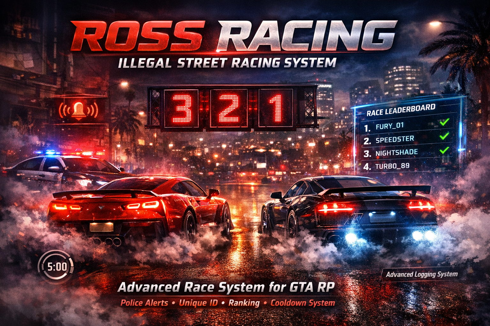

# RossRacing – Illegal Street Racing System

## 📌 Apresentação
**RossRacing – Illegal Street Racing System** é um script completo e exclusivo de corridas ilegais desenvolvido para servidores de GTA RP (FiveM). Com foco em realismo, competitividade e imersão, o sistema integra economia (dinheiro sujo), risco (explosões e polícia) e um **Sistema de Ranking Global Persistente**.

---

### 🚀 **Compre agora / Suporte**

> **[Clique aqui para entrar no Discord](https://discord.com/invite/Tax7zUGy7C)**

---

### Destaques do Sistema
*   **🏆 Ranking Global e Pessoal (SQL):** Salva automaticamente os melhores tempos no banco de dados. Visualize o Top 10 de cada pista ingame com sistema de apelidos persistentes.
*   **🏎️ Lobby Multiplayer:** Suporte para corridas com múltiplos jogadores sincronizados. Largada conjunta!
*   **💣 Corrida Hardcore:** Se o tempo acabar ou você abandonar o veículo, o carro explode.
*   **🎟️ Sistema de Tickets:** Acesso restrito via compra de tickets com NPC usando dinheiro sujo.
*   **👮 Integração Policial:** A presença de policiais aumenta a recompensa (Risco x Recompensa).
*   **📊 Interface Visual (HUD):** Textos 3D interativos, contagem regressiva estilo corrida, e notificações de vitória/recorde dedicadas com efeitos sonoros.
*   **🔄 Totalmente Configurável:** Coordenadas, preços, tempos, mensagens e integração com qualquer base (ESX, QBCore, vRP, Creative).

---

## ⚙️ Funcionamento Geral

### 1. Iniciando uma Corrida
Para iniciar uma corrida, o jogador precisa de um **Ticket de Corrida**.
1.  Vá até o NPC (marcado ou escondido, configurável) e compre o ticket.
2.  Vá até o ponto de início da corrida com um veículo.
3.  **Comandos no Blip:**
    *   **[E]** Iniciar Lobby / Entrar na Corrida.
    *   **[G]** Visualizar Ranking (Top 10 Melhores Tempos).

### 2. A Corrida (Lobby)
*   Ao criar um lobby, outros jogadores podem entrar.
*   Quando a contagem termina, todos largam juntos.
*   **Regras:**
    *   Siga os checkpoints.
    *   Não saia do veículo (Explosão em 5s).
    *   Chegue antes do tempo limite (Explosão se falhar).

### 3. Pós-Corrida e Ranking
*   **Vencedor:** Quem chegar primeiro ganha o prêmio principal + bônus de vitória.
*   **Novo Recorde:** Se você bater seu próprio tempo, uma tela especial de **"NOVO RECORDE"** aparecerá após o resultado.
*   **Economia:** Pagamentos em dinheiro sujo. Bônus extra se houver policiais online.

---

## 🛠️ Instalação e Requisitos

### Pré-requisitos
*   **vRP / Creative / ESX / QBCore** (Bridge configurável em `config.lua`)
*   **oxmysql / mysql-async** (Para salvar o ranking)

### 1. Banco de Dados (Obrigatório)
Para que o sistema de Ranking funcione, você **DEVE** executar o arquivo SQL no seu banco de dados.
1.  Abra seu gerenciador SQL (HeidiSQL, phpMyAdmin).
2.  Execute o arquivo `ranking.sql` incluído na pasta do script.
3.  Isso criará a tabela `rossracing_ranking`.

### 2. Configuração (config.lua)
O arquivo `config.lua` permite ajustar a "Bridge" para sua base (Creative, vRP, ESX, etc).
*   **Framework:** Ajuste as funções `ServerCheckMoney`, `ServerRemoveMoney`, etc.
*   **NPC:** Modelo e coordenadas.
*   **Webhook:** Adicione seu link do Discord para logs detalhados.

### 3. Criando Novos Circuitos (circuitos.lua)
Edite `circuitos.lua` para criar novas rotas. O sistema é modular e aceita infinitas pistas.

---

## 📂 Estrutura de Arquivos
*   `client.lua`: Lógica do cliente (HUD, Lobby, Markers, Explosão) - **Disponível**.
*   `server.lua`: Lógica do servidor completa (Protegido/Ofuscado) - **Funcional**.
*   `config.lua`: Configurações gerais e Bridge - **Disponível**.
*   `circuitos.lua`: Definição das pistas - **Disponível**.
*   `ranking.sql`: Estrutura do banco de dados para os recordes - **Disponível**.

---

## 📝 Logs e Monitoramento
O sistema gera logs no Discord para:
*   Compra de Ticket.
*   Início de Corrida (com lista de participantes e policiais online).
*   Resultado Final (Vencedor, Tempos, Prêmios).
*   Falhas e Cancelamentos.

---

**RossRacing – Illegal Street Racing System**
*Desenvolvido para alta performance e imersão.*
